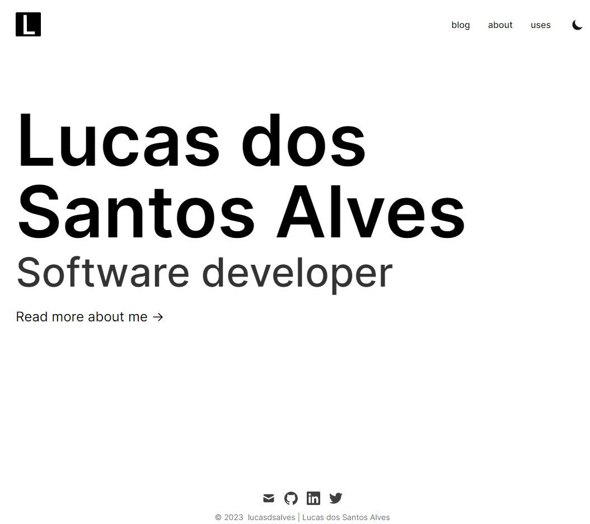

# [lucasdsalves.com](https://www.lucasdsalves.com/) 💻🌐🙋‍♂️

This is my personal website built with the following stacks:

- [Next.js](https://nextjs.org/)
- [Vercel](https://vercel.com)
- [Tailwind CSS](https://tailwindcss.com/)
- [Markdown](https://mdxjs.com/)

<kbd>

</kbd>

## Running it locally 🏃‍♂️🏠

1. Clone the project

```bash
git clone https://github.com/lucasdsalves/lucasdsalves.com.git
```

2. Go to the project folder

```bash
cd lucasdsalves.com
```

3. Install dependencies

```bash
npm install
```

4. Run the development server:

```bash
npm start
```

or

```bash
npm run dev
```

5. Open [http://localhost:3000](http://localhost:3000) with your browser to see the result.

## Project structure 🏗️

```bash
📦 root
├── 📁 components             # React files to customize the components for the site
├── 📁 css                    # Tailwind and Prism CSS files
├── 📁 data                   # Files to change the content of pages
│ ├── 📁 authors              # Markdown files for authors of blog
│ ├── 📁 blog                 # Markdown files for blog posts
├── 📁 layouts                # JS Layouts for pages
├── 📁 lib                    # Non-react modules
├── 📁 pages                  # All page files for website
├── 📁 public                 # Static files for images, rss, and assets
│ ├── 📁 static               # Holds images, favicons, and other assets
│ │ ├── 📁 favicon            # Favicon files
│ │ └── 📁 images             # Image Files
│ ├── 📝 feed.xml             # RSS feed
├── 📁 scripts                # Scripts to run for different tasks
├── 📝 tailwind.config.js     # Contains tailwind stylesheet to change the look
└── 📝 next.config.js         # Configuration related to Next.js
└── 📝 prettier.config.js     # Configuration related to Prettier
```

## Composing a new post ✏️

Run `node ./scripts/compose.js` to bootstrap a new post.

## Inspiration and template origin 💡

This website was built based on [Timothy Lin](https://github.com/timlrx) template [Tailwind Nextjs Starter Blog](https://github.com/timlrx/tailwind-nextjs-starter-blog).

Inspired by:

- [dalelarroder.com](https://dalelarroder.com) - Dale Larroder's personal website and blog

- [sabare.me](https://sabare.me/) - Victor Sabare's personal website and blog
- [zenorocha.com](https://zenorocha.com) - Zeno Rocha's personal website and blog

## Licence 🗞️

[MIT](https://github.com/lucasdsalves/lucasdsalves.com/blob/main/LICENSE) © [Lucas dos Santos Alves](https://www.lucasdsalves.com)
